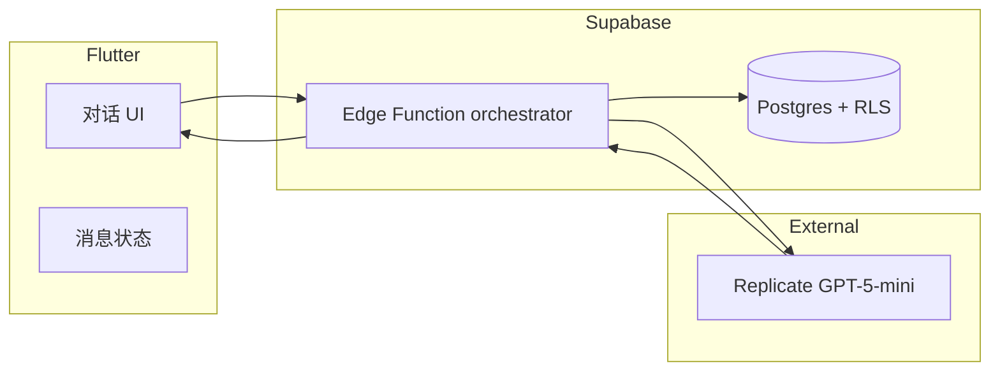

# AI 互动剧本应用（Flutter）

## 1. 项目概览
- **定位**：基于大模型驱动的互动剧本游戏平台，参考 AI Dungeon 的设计理念。
- **核心特性**：
  - **多剧本支持**：提供历史穿越、奇幻冒险、科幻探索等多种互动剧本类型。
  - **沉浸式体验**：聊天式界面让玩家通过文字选择推动剧情发展，每个决策都会影响故事走向。
  - **AI 驱动剧情**：调用 Supabase Edge Function，转发至 Replicate `openai/gpt-5-mini` 实现动态剧情生成。
  - **数据持久化**：统一将消息、局势进度与日志落库，支持后续分析与记忆检索。
- **示例剧本**：
  - 崇祯皇帝：扮演明朝末代皇帝，在内忧外患中力挽狂澜。
  - 更多剧本持续开发中...
- **目录**：位于 `app/`，与 Supabase 配置、迁移文件协同工作。

## 2. 技术栈
- **前端框架**：Flutter 3.x。
- **状态管理**：内置 `StatefulWidget` + 后续可扩展 `riverpod`。
- **后端服务**：Supabase Edge Functions（Deno），存储使用 Supabase Postgres + Vector Extension。
- **大模型调用**：Replicate 平台上的 `openai/gpt-5-mini`。
- **配置管理**：`.env`（仅存放 Supabase 公钥），敏感密钥通过 Supabase Secrets 管理。

## 3. 架构概述


- **Flutter**：收集用户输入、展示消息列表、调用 Edge Function。
- **Edge Function**：执行提示构造、调用 Replicate、写入 `chat_messages` / `session_logs` / `situation_states`。
- **数据库**：`stories`、`chapters`、`situations`、`chat_sessions`、`chat_messages`、`memory_records` 等表以 RLS 保护数据。

## 4. 本地开发流程
1. **安装依赖**
   ```bash
   flutter pub get
   ```
2. **配置环境变量**：在 `app/.env` 填写
   ```env
   SUPABASE_URL=...
   SUPABASE_ANON_KEY=...
   ```
3. **Supabase 配置**：
   - `supabase db push` 同步迁移表与注释。
   - `supabase secrets set REPLICATE_API_TOKEN=xxxx` 配置模型密钥。
   - `supabase functions deploy orchestrator` 部署函数。
4. **运行 Flutter 应用**：
   ```bash
   flutter run
   ```

## 5. Edge Function 快速说明
- 位置：`supabase/functions/orchestrator/index.ts`。
- 功能：
  - 接收 Flutter 传递的 `messages` 列表。
  - 调用 Replicate predictions API（轮询等待结果）。
  - 解析模型输出并以 `{ reply, status }` 返回。
  - 后续可扩展写入数据库或接入记忆检索。

## 6. 数据库结构摘要
- 迁移文件：`supabase/migrations/20251022T063200_create_chat_tables.sql`。
- 字段注释：`supabase/migrations/20251022T064800_add_column_comments.sql`。
- 核心表：
  - `stories` / `chapters` / `situations`：剧本模板。
  - `chat_sessions`：用户会话。
  - `chat_messages`：对话消息。
  - `situation_states`：局势状态。
  - `session_logs`：流程日志。
  - `memory_records`：长记忆与向量检索。

## 7. TODO / 后续计划
- 引入 `riverpod` 管理多会话状态。
- Edge Function 写入数据库并读取 `memory_records` 驱动 RAG。
- 构建剧本编辑工具，支持 UGC。
